  

I run endpoint management and identity for real fleets — Windows and macOS, on-site and remote — and document the work as I go. Currently building out Azure Virtual Desktop and AWS labs alongside production Intune, Entra ID, and Defender ownership.

Everything in these repos is work I can defend under technical follow-up. No inflated claims.

### What I work with

### Where the work lives

**[Endpoint-Engineer](https://github.com/Mcloudfra/Endpoint-Engineer)** — the portfolio repo. Labs, production documentation, automation.

- `intune/autopilot` — zero-touch provisioning, ESP, deployment profiles
- `intune/app-deployment` — Win32 packaging, Graph API upload pipeline, printer remediation automation
- `intune/conditional-access` — device- and identity-based access enforcement
- `azure/avd-labs` — host pools, FSLogix, session host deployment
- `azure/az-104-labs` — VNet, NSG, storage, RBAC
- `docs/weekly-log.md` — running build log, updated same day

### Certifications

MD-102 Endpoint Administrator — held
AZ-104 Azure Administrator — in progress
